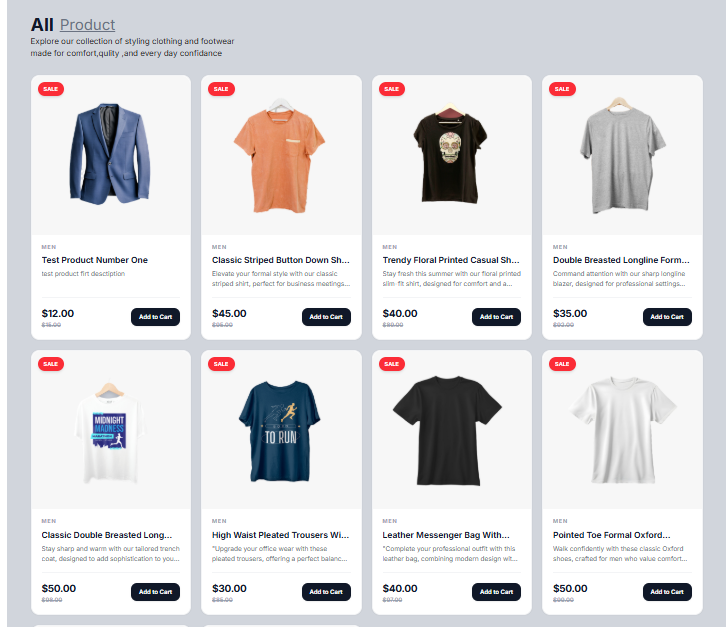
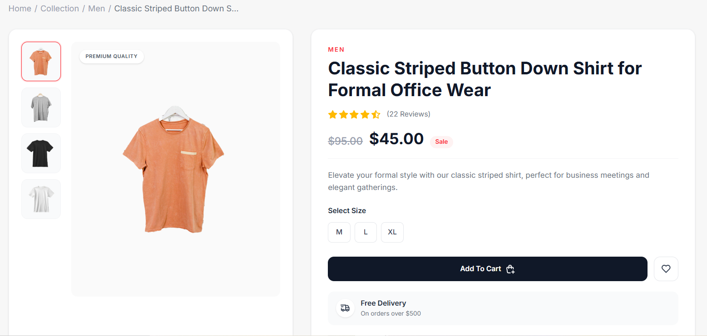
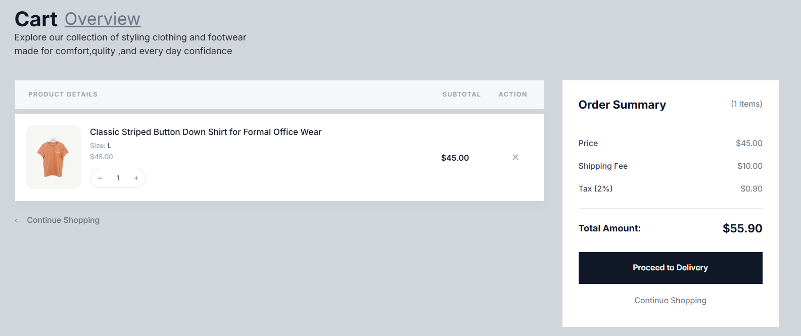
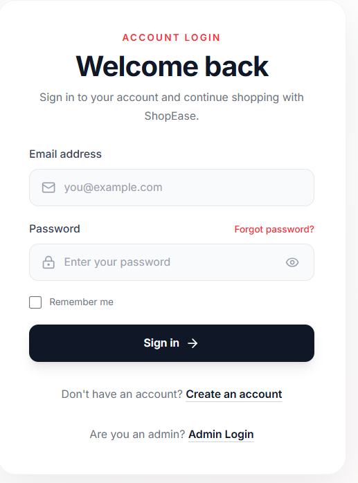
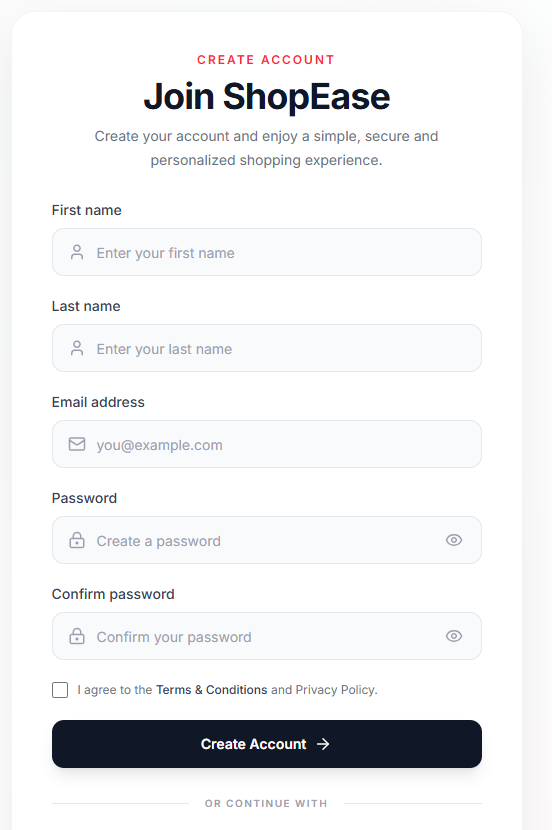
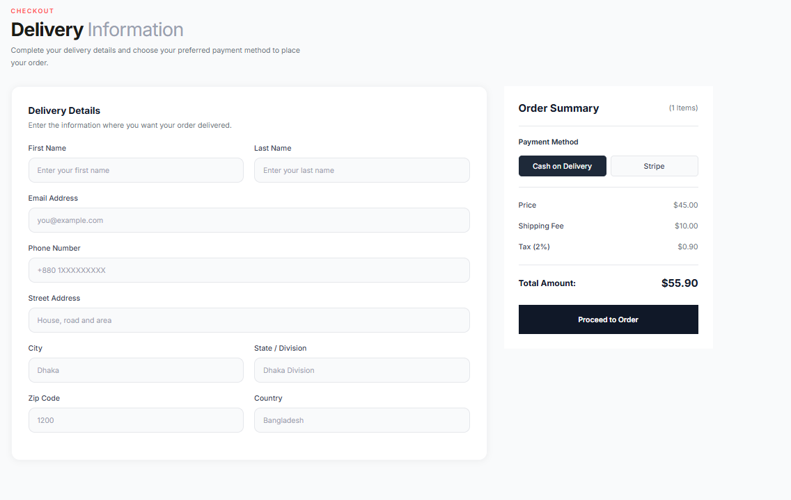

# 🛍️ ShopEase — Modern E-Commerce Frontend

<p align="center">
  <strong>A modern, responsive, and user-friendly e-commerce frontend built with React and Vite.</strong>
</p>

<p align="center">
  <a href="https://shop-ease-client-seven.vercel.app">🌐 Live Demo</a>
  ·
  <a href="https://github.com/tamimhasan13/shopEase-client">📦 GitHub Repository</a>
</p>

---

## 📸 Project Screenshots

> Replace the image paths below with your actual screenshots.

### 🏠 Home Page


### 🛍️ Product Listing



### 📦 Product Details



### 🛒 Shopping Cart



### 🔐 User Login



### 📝 User Registration



### 💳 Checkout



### 👨‍💼 Admin Panel


---

## ✨ Features

### 👤 User Features

* 🔐 User registration and login
* 🍪 Secure authentication using HTTP-only cookies
* 👤 User authentication state management
* 🔑 Forgot password functionality
* 🛍️ Browse available products
* 🔎 Product details
* 📏 Product size selection
* 🛒 Add products to cart
* ➕ Increase cart quantity
* ➖ Decrease cart quantity
* 🗑️ Remove products from cart
* 💰 Automatic cart total calculation
* 🚚 Shipping fee calculation
* 🧾 Tax calculation
* 💳 Stripe checkout integration
* 📦 Order placement
* 📱 Fully responsive design

### 👨‍💼 Admin Features

* 🔐 Separate admin authentication
* 📊 Admin dashboard
* ➕ Add products
* ✏️ Manage products
* 🗑️ Delete products
* 📦 Manage orders
* 👥 Admin-only protected functionality

### 🎨 UI / UX

* Clean modern interface
* Responsive design
* Mobile-friendly layout
* Loading states
* Toast notifications
* Password visibility toggle
* Form validation
* Interactive buttons and controls
* Smooth hover and transition effects

---

## 🧰 Technologies Used

| Technology         | Purpose                    |
| ------------------ | -------------------------- |
| ⚛️ React           | Frontend UI                |
| ⚡ Vite             | Development & build tool   |
| 🎨 Tailwind CSS    | Styling                    |
| 🧭 React Router    | Client-side routing        |
| 📡 Axios           | API communication          |
| 📝 React Hook Form | Form handling & validation |
| 🔔 React Hot Toast | Notifications              |
| 🎯 Lucide React    | Icons                      |
| 💳 Stripe          | Payment integration        |
| ▲ Vercel           | Deployment                 |

---

## 🏗️ Project Architecture

ShopEase follows a component-based React architecture with centralized authentication, cart, product, and API state management.

```text
shopEase-client/
│
├── public/
│   └── ...
│
├── src/
│   │
│   ├── assets/
│   │   └── images/
│   │
│   ├── components/
│   │   ├── Navbar/
│   │   ├── Footer/
│   │   ├── ProductCard/
│   │   └── ...
│   │
│   ├── context/
│   │   └── AuthContext/
│   │       ├── AuthContext.jsx
│   │       └── AuthContextProvider.jsx
│   │
│   ├── pages/
│   │   ├── Home/
│   │   ├── Shop/
│   │   ├── ProductDetails/
│   │   ├── Cart/
│   │   ├── Login/
│   │   ├── Register/
│   │   ├── ForgotPassword/
│   │   ├── Orders/
│   │   └── Admin/
│   │
│   ├── App.jsx
│   ├── main.jsx
│   └── index.css
│
├── .env
├── .gitignore
├── index.html
├── package.json
├── vite.config.js
└── README.md
```

> Folder names may vary depending on the final project structure.

---

## 🔄 Application Flow

```text
                    ┌───────────────────┐
                    │      ShopEase     │
                    │   React Frontend  │
                    └─────────┬─────────┘
                              │
                ┌─────────────┴─────────────┐
                │                           │
          User Authentication          Product Browsing
                │                           │
                ▼                           ▼
        ┌───────────────┐           ┌───────────────┐
        │ Auth Context  │           │ Product APIs  │
        └───────┬───────┘           └───────┬───────┘
                │                           │
                └─────────────┬─────────────┘
                              │
                              ▼
                    ┌───────────────────┐
                    │ ShopEase Backend  │
                    │      REST API     │
                    └─────────┬─────────┘
                              │
               ┌──────────────┼──────────────┐
               │              │              │
               ▼              ▼              ▼
            MongoDB       Cloudinary       Stripe
```

---

## 🔐 Authentication

ShopEase uses cookie-based authentication.

Authentication requests are sent with credentials enabled:

```js
axios.defaults.withCredentials = true;
```

The backend manages authentication using secure HTTP-only cookies.

For production, the backend uses:

```js
{
  httpOnly: true,
  secure: true,
  sameSite: "none"
}
```

This allows the deployed frontend and backend to communicate securely across different domains.

---

## 🛒 Cart Management

Cart data is synchronized with the backend.

The frontend maintains cart state using React Context.

Supported operations:

```text
Add Product
     ↓
Update Quantity
     ↓
Remove Product
     ↓
Calculate Total
     ↓
Checkout
```

Cart data is persisted for authenticated users through the backend.

---

## 💳 Payment System

ShopEase uses **Stripe Checkout** for online payments.

### Payment Flow

```text
User
 │
 ▼
Add products to cart
 │
 ▼
Checkout
 │
 ▼
Create Stripe Checkout Session
 │
 ▼
Stripe Payment
 │
 ▼
checkout.session.completed
 │
 ▼
Backend Webhook
 │
 ├── Mark order as paid
 │
 └── Clear user's cart
```

The Stripe webhook endpoint is:

```text
POST /stripe
```

---

## ⚙️ Environment Variables

Create a `.env` file in the project root:

```env
VITE_BACKEND_URL=https://your-backend-url.vercel.app
VITE_CURRENCY=$
```

### Example

```env
VITE_BACKEND_URL=https://shop-ease-server.vercel.app
VITE_CURRENCY=$
```

> ⚠️ Never commit private API keys, passwords, database credentials, JWT secrets, Stripe secret keys, or other sensitive credentials to GitHub.

---

## 🚀 Installation & Setup

### 1. Clone the repository

```bash
git clone https://github.com/tamimhasan13/shopEase-client.git
```

### 2. Enter the project directory

```bash
cd shopEase-client
```

### 3. Install dependencies

```bash
npm install
```

### 4. Configure environment variables

Create:

```text
.env
```

Then add:

```env
VITE_BACKEND_URL=https://your-backend-url.vercel.app
VITE_CURRENCY=$
```

### 5. Start the development server

```bash
npm run dev
```

The application will be available at:

```text
http://localhost:5173
```

---

## 🏗️ Build for Production

Create a production build:

```bash
npm run build
```

Preview the production build locally:

```bash
npm run preview
```

---

## 🌐 Deployment

The frontend is deployed using **Vercel**.

### Production Frontend

🌐 **Live Website**

https://shop-ease-client-seven.vercel.app

### Deployment Flow

```text
Local Development
       │
       ▼
   Git Commit
       │
       ▼
   GitHub Push
       │
       ▼
      Vercel
       │
       ▼
 Automatic Deployment
       │
       ▼
 Production Website
```

Every new push to the connected GitHub branch can trigger a new Vercel deployment.

---

## 🔗 Backend

ShopEase communicates with a separate backend API.

### Backend Repository

https://github.com/tamimhasan13/shopEase-server

### Backend Responsibilities

* User authentication
* Admin authentication
* Product management
* Cart management
* Order management
* MongoDB database operations
* Cloudinary image management
* Stripe payment processing
* Stripe webhook handling

---

## 📁 Main API Endpoints

| Method | Endpoint             | Purpose                    |
| ------ | -------------------- | -------------------------- |
| `POST` | `/api/user/register` | Register user              |
| `POST` | `/api/user/login`    | User login                 |
| `POST` | `/api/user/logout`   | User logout                |
| `GET`  | `/api/user/is-auth`  | Check authentication       |
| `GET`  | `/api/product/list`  | Get products               |
| `POST` | `/api/cart/add`      | Add product to cart        |
| `POST` | `/api/cart/update`   | Update cart quantity       |
| `POST` | `/api/cart/remove`   | Remove cart item           |
| `GET`  | `/api/admin/is-auth` | Check admin authentication |
| `POST` | `/api/order/...`     | Order operations           |
| `POST` | `/stripe`            | Stripe webhook             |

---

## 🧪 Testing

Before production deployment, test the following:

* [ ] User registration
* [ ] User login
* [ ] User logout
* [ ] Authentication persistence
* [ ] Product loading
* [ ] Product details
* [ ] Add to cart
* [ ] Update cart quantity
* [ ] Remove from cart
* [ ] Cart persistence after refresh
* [ ] Checkout
* [ ] Stripe test payment
* [ ] Order creation
* [ ] Stripe webhook
* [ ] Admin login
* [ ] Admin product management
* [ ] Admin order management
* [ ] Mobile responsiveness

### Stripe Test Card

For Stripe test mode:

```text
Card Number: 4242 4242 4242 4242
Expiry:      12/34
CVC:         123
ZIP:         12345
```

> Use Stripe test mode only. Never use test card details for real payments.

---

## 🖥️ Responsive Design

ShopEase is designed to work across:

```text
📱 Mobile
📱 Tablet
💻 Laptop
🖥️ Desktop
```

The interface adapts to different screen sizes using responsive Tailwind CSS utilities.

---

## 🎯 Future Improvements

Potential improvements for future versions:

* [ ] Product search
* [ ] Advanced filtering
* [ ] Product categories
* [ ] Wishlist
* [ ] Product reviews & ratings
* [ ] Order tracking
* [ ] User profile management
* [ ] Pagination
* [ ] Coupon/discount system
* [ ] Advanced admin analytics
* [ ] Dark mode
* [ ] Email notifications
* [ ] Improved accessibility

---

## 👨‍💻 Developer

**Tamim Hasan**

Frontend Developer | React | JavaScript | Tailwind CSS

### Project

**ShopEase — E-Commerce Platform**

---

## 📄 License

This project is created for learning, development, and portfolio purposes.

---

<p align="center">
  Made with ❤️ using React & Vite
</p>

<p align="center">
  ⭐ If you like this project, consider giving the repository a star!
</p>
